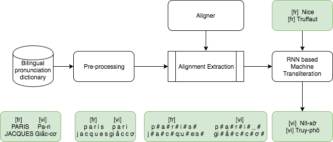

# Transliteration for Named Entity using Recurrent Neural Network
Build a Neural Network Model for Low Resource Machine Transliteration

### Datasets Files format
French-Vietnamese Bilingual dictionary  
ACL 2018 >> Named Entity Workshop datasets : http://workshop.colips.org/news2018/dataset.html

### Architecture of our machine transliteration

### Tools to use
* m-2-m aligner (Jiampojamarn et al., 2007) : https://github.com/letter-to-phoneme/m2m-aligner/  
* word2vec (Mikolov et al., 2013) : https://code.google.com/archive/p/word2vec/  
* nmt-keras (Peris, 2017) to train a neural network machine translittération, https://github.com/lvapeab/nmt-keras/  
* Sequitur-G2P (Bisani et Ney, 2008) : https://www-i6.informatik.rwth-aachen.de/web/Software/g2p.html  
* Moses (Koehn, 2009) : http://www.statmt.org/moses_steps.html 

### Cite our Papers
Ngoc Tan Le, Fatiha Sadat, Lucie Ménard, Dien Dinh. Low Resource Machine Transliteration Using Recurrent Neural Network. In Proceedings of ACM Transactions on Asian and Low-Resource Language Information Processing (TALLIP), ISSN 2375-4699, Inf. Process. 18(2): 13:1-13:14 (2019).

Ngoc Tan Le et Fatiha Sadat. Low-Resource Machine Transliteration Using Recurrent Neural Networks of Asian Languages. In Proceedings of the Seventh Named Entities Workshop, Association for Computational Linguistics, Melbourne, Australia, July 20, 2018, pages 1-6.

Ngoc Tan Le, Fatiha Sadat, Lucie Ménard. Nouvelle méthode de construction d’un système de translittération pour une paire de langues peu dotée en utilisant l’approche à base des réseaux de neurones. 86ème Congrès de l’ACFAS – Association francophone pour le savoir, Université du Québec à Chicoutimi, Québec, Canada, 7-11 Mai 2018, communication libre.

Ngoc Tan Le, Fatiha Sadat, Lucie Ménard. A Neural Network Transliteration Model in Low Resource Settings. In Proceedings of the 16th International Conference of Machine Translation Summit, September 18-22 2017, Nagoya, Japan, volume 1, Research Track. 337–345.
